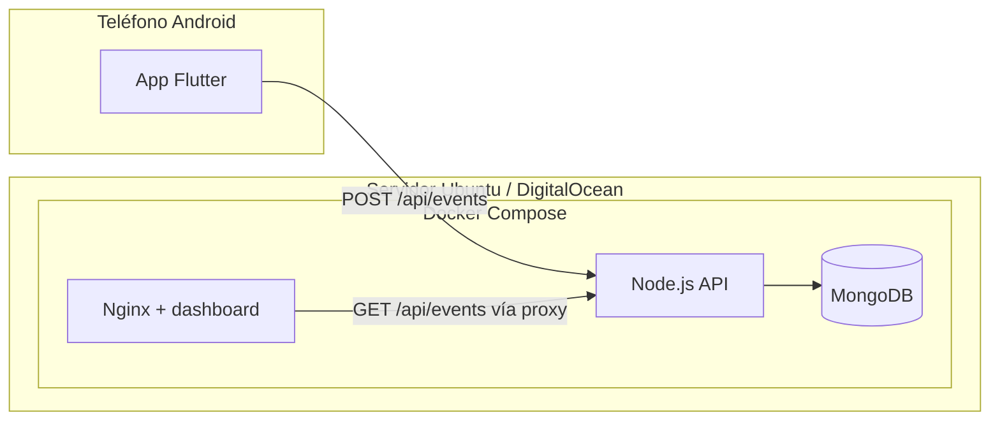

# Sistema de Monitoreo en la Nube — Ubuntu Server

**Proyecto:** PRF-SOll — Proyecto Final de Sistemas Operativosll (Grupo #5, Sección A)

---

# Robot Asistente (JOY) + Sistema de Monitoreo en la Nube

Aplicación robótica desarrollada para el proyecto Robot Inteligente de Asistencia Emocional, orientada al control inalámbrico, interacción inteligente y monitoreo remoto mediante infraestructura basada en Ubuntu Server y contenedores Docker.

El sistema integra:
comunicación WiFi y Bluetooth
monitoreo remoto
backend API
almacenamiento de eventos
dashboard web
arquitectura distribuida

## Introducción.

Este módulo corresponde al servidor Ubuntu utilizado dentro del proyecto Robot Inteligente de Asistencia Emocional.

El servidor permite centralizar la recepción, monitoreo y almacenamiento de eventos generados por el robot durante su funcionamiento, facilitando el control remoto, supervisión del sistema y administración de registros del robot.

La arquitectura implementada utiliza contenedores Docker para separar servicios de backend, frontend y base de datos, permitiendo una infraestructura modular, organizada y escalable.

## Objetivos del servidor 

Implementar monitoreo remoto del robot.
Registrar eventos generados por el sistema.
Centralizar información mediante Ubuntu Server.
Permitir comunicación remota vía HTTP.
Almacenar logs y acciones del robot.
Implementar servicios mediante Docker Compose.

## Dirección IP pública del servidor

Sustituir por la IP pública asignada al servidor Ubuntu en DigitalOcean.
Sustituye por la IP de tu droplet de DigitalOcean (ejemplo de referencia: `142.93.3.189`).

- **Dashboard web (HTTP):** `http://TU_IP/`
- **API de eventos (HTTP):** `http://TU_IP:8080/`

En el panel de DigitalOcean, abre los puertos **80** y **8080** (Firewall / Networking → Inbound rules).

## Puertos utilizados

| Puerto | Servicio             |
| ------ | -------------------- |
| 80     | Frontend / Dashboard |
| 8080   | Backend API          |
| 27017  | MongoDB interno      |


## Arquitectura general del sistema



Flujo: la app envía eventos (comandos, ping, parada segura) al backend; el backend persiste en MongoDB; el navegador consulta el mismo API a través del frontend (proxy `/api/`).

## Tecnologías utilizadas

| Componente | Tecnología |
|------------|------------|
| App móvil | Flutter (Dart), paquete `http` |
| Backend | Node.js 20, Express, controlador MongoDB oficial |
| Base de datos | MongoDB 7 en contenedor |
| Frontend | HTML/CSS/JS estático servido por Nginx |
| Orquestación | Docker Compose |

Código de la pila: carpeta `monitoring/`.


## Estructura del sistema
monitoring/
├── backend/
├── frontend/
├── docker-compose.yml
├── README.md

## Servicios implementados

# Backend API

Servicio encargado de:
recibir eventos del robot
almacenar logs
procesar solicitudes HTTP
administrar monitoreo

Puerto utilizado: 80

# Frontend Dashboard

Interfaz web utilizada para visualizar:
eventos registrados
monitoreo general
estado del sistema

Puerto utilizado:80

## Base de datos MongoDB

Servicio encargado del almacenamiento persistente de:
eventos
logs
acciones ejecutadas
monitoreo del robot

Implementado mediante contenedor Docker independiente.


## Instrucciones de uso

### 1. Servidor (Ubuntu en DigitalOcean)

1. Instala Docker y el plugin Compose ([documentación oficial](https://docs.docker.com/engine/install/ubuntu/)).
2. **Importante (requisito del enunciado):** MongoDB debe ir **en Docker**. Si instalaste MongoDB en el sistema (`mongod`), detén el servicio para ahorrar RAM en droplets pequeños:  
   `sudo systemctl disable --now mongod`
3. Sube la carpeta `monitoring/` al servidor (por ejemplo con `scp` o clonando tu repositorio).
4. En el servidor:

```bash
cd monitoring
docker compose up -d --build
```

5. Comprueba contenedores: `docker compose ps`  
   Salud del API: `curl -s http://127.0.0.1:8080/health`

### 2. App Flutter: enviar eventos al backend

Compila o ejecuta definiendo la URL base del API (puerto **8080**):

```bash
flutter run --dart-define=EVENT_LOG_URL=http://TU_IP:8080
```

Si no defines `EVENT_LOG_URL`, la app funciona igual pero **no** envía eventos al servidor.

### 3. Guía rápida para la demostración (pausar contenedores)

Desde `monitoring/`:

| Qué demostrar | Comando |
|----------------|---------|
| Sin backend no hay registro | `docker compose stop backend` → enviar desde la app; luego `docker compose start backend` |
| Sin base de datos: se recibe pero no guarda | `docker compose stop mongo` (el backend puede devolver error 500 al guardar) |
| Sin frontend: no hay dashboard, el API sigue | `docker compose stop frontend` → la app puede seguir enviando a `:8080` |

## Estructura del repositorio

- `lib/` — código Flutter.
- `monitoring/docker-compose.yml` — tres servicios en contenedores.
- `monitoring/backend/` — API REST.
- `monitoring/frontend/` — dashboard web.

## Getting Started (Flutter)

Para desarrollo local del cliente móvil, consulta la [documentación de Flutter](https://docs.flutter.dev/).
